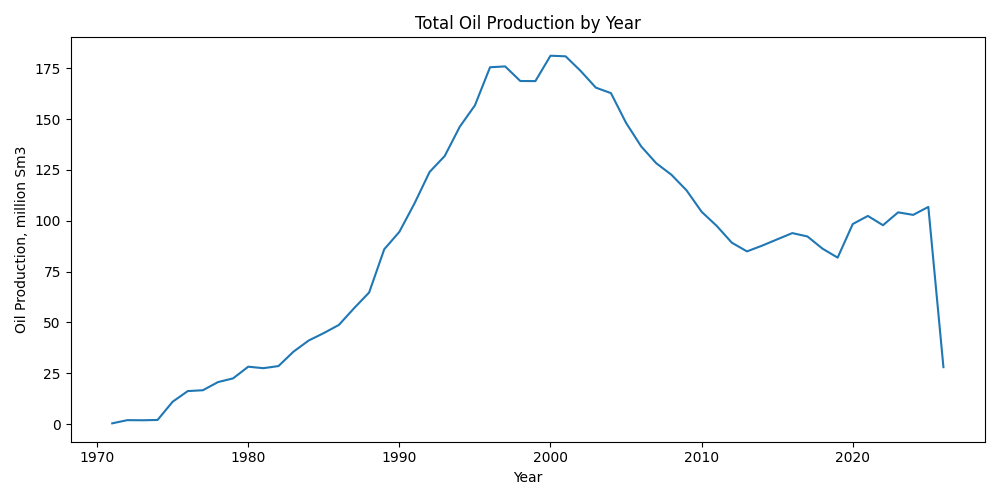
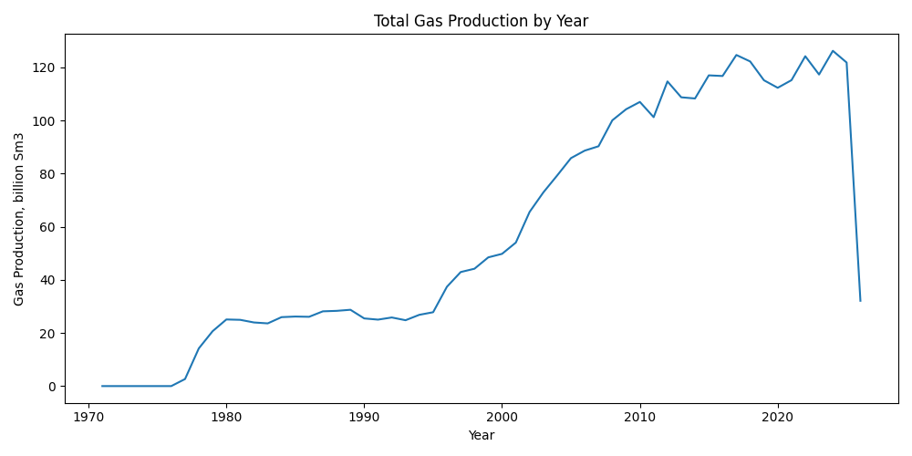
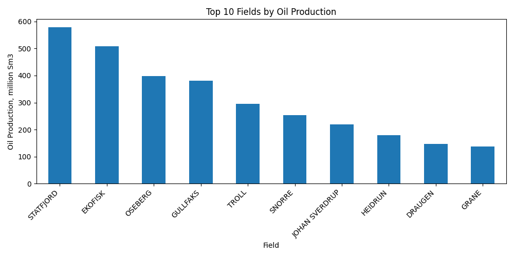
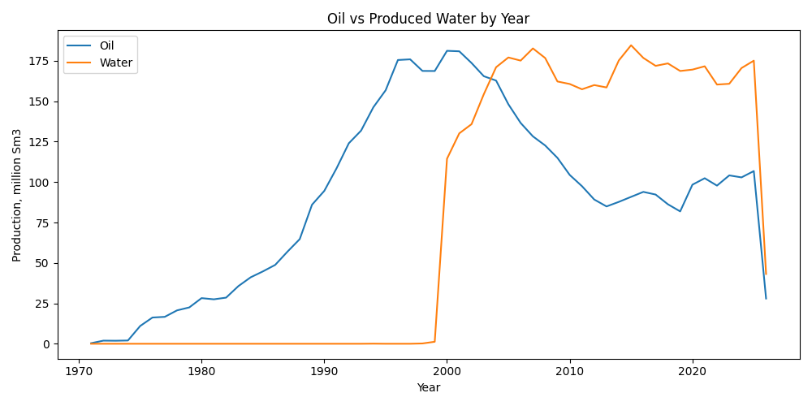
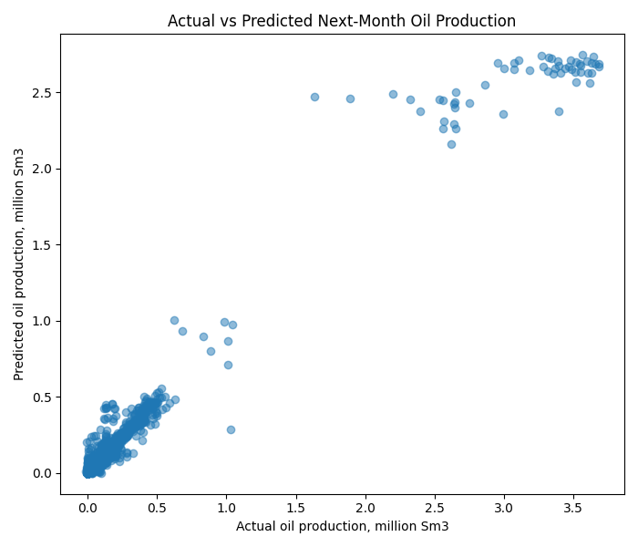
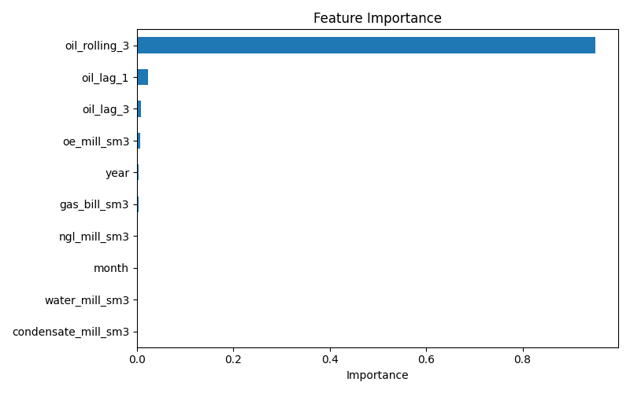

# Norwegian Production Analytics

Real-world data science project analyzing Norwegian oil and gas field production data using Python, Pandas, Matplotlib, and scikit-learn.

## Dataset

Source: Norwegian Offshore Directorate monthly field production dataset.

The dataset contains monthly production records for Norwegian petroleum fields, including oil, gas, NGL, condensate, oil equivalent, and produced water.

## Project Goals

- Clean real petroleum production data
- Analyze production trends by year and field
- Visualize oil, gas, and water production patterns
- Engineer time-series features
- Build a baseline next-month oil production forecasting model

## Tech Stack

Python, Pandas, NumPy, Matplotlib, scikit-learn, Git, GitHub

## How to Run

Clone the repository:

    git clone https://github.com/milanakarimova/norwegian-production-analytics.git
    cd norwegian-production-analytics

Install dependencies:

    pip install -r requirements.txt

Run the pipeline:

    python src/clean_data.py
    python src/eda.py
    python src/model.py

## Model Results

The baseline next-month oil production forecasting model achieved:

| Metric | Value |
|---|---:|
| MAE | 0.0172 million Sm³ |
| R² | 0.9486 |

## Visualizations

### Total Oil Production by Year

### Total Gas Production by Year

### Top 10 Fields by Oil Production

### Oil vs Produced Water by Year

### Actual vs Predicted Oil Forecast

### Feature Importance

## Project Structure

    data/
      raw/
      processed/
    src/
      clean_data.py
      eda.py
      model.py
    reports/
      figures/
    requirements.txt
    README.md

## Portfolio Value

This project demonstrates applied data science for petroleum production analytics, combining geoscience domain knowledge with Python-based data analysis, visualization, feature engineering, and machine learning.
